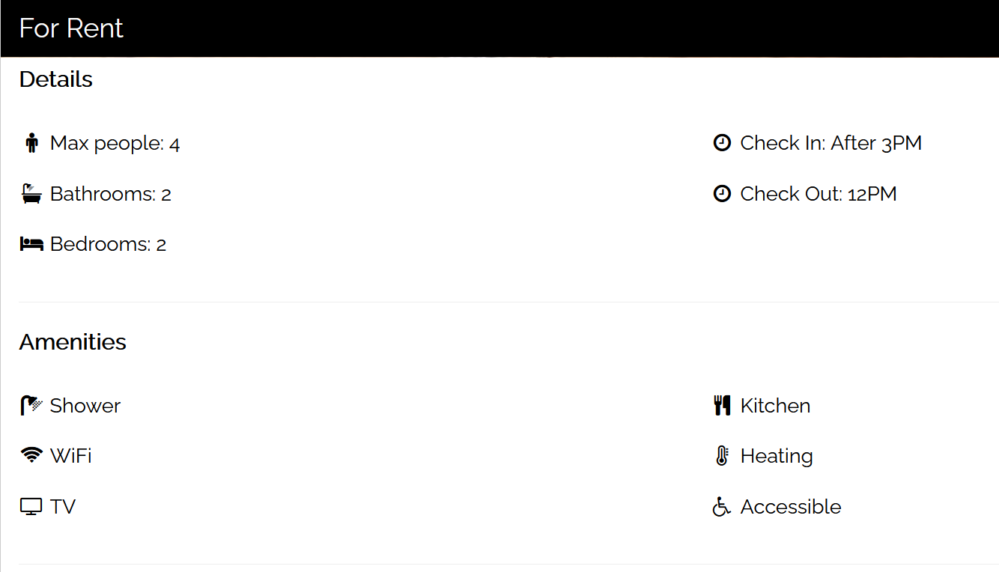
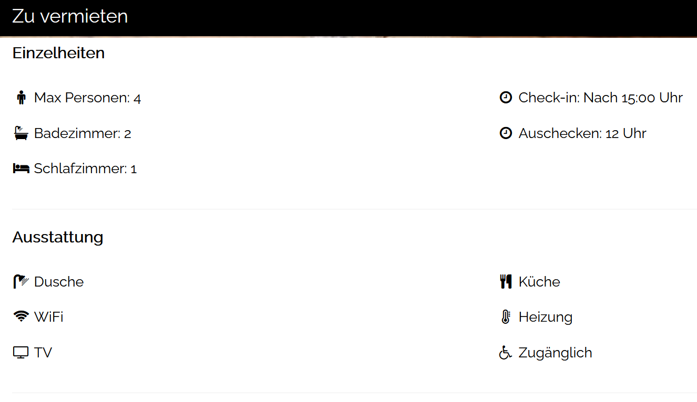

# Introduction to i18n in FastAPI
This tutorial will show you how do internationalization in your FastAPI application. We are going to make full use of the glob and json modules in creating a multilingual room rental application.

# Setup
For your information, this tutorial is based on Python3. We are going to use the following modules in our project.
* fastapi
* uvicorn
* jinja2
* aiofiles
* json
* glob

Run the following command in your terminal.

    pip install fastapi

    pip install uvicorn

    pip install jinja2

    pip install aiofiles

# Language Files
Language files is based on simple JSON data format.

```js
{
  "webpage_title": "MyRental",
  "for_rent": "For Rent",
  "details": "Details",
  "max_people": "Max people",
  "bathroom": "Bathrooms",
  "bedroom": "Bedrooms",
  "check_in": "Check In: After 3PM",
  "check_out": "Check Out: 12PM",
  "amenities": "Amenities",
  "shower": "Shower",
  "wifi": "WiFi",
  "television": "TV",
  "kitchen": "Kitchen",
  "heating": "Heating",
  "accessible": "Accessible",
  "extra_info_title": "Extra Info",
  "extra_info_text": "Our apartment is really clean and we like to keep it that way. Enjoy the beautiful scenery around the building.",
  "we_accept": "We accept"
}
```

# index.html
To keep things simple, this tutorial will use a modified version of [apartment rental HTML template made by W3.CSS](https://www.w3schools.com/w3css/tryw3css_templates_apartment_rental.htm)

# myapp_rental.py
Complete code for FastAPI server

```python
from fastapi import FastAPI, Request
from fastapi.responses import HTMLResponse
from fastapi.staticfiles import StaticFiles
from fastapi.templating import Jinja2Templates

import glob
import json

app = FastAPI()

app.mount("/static", StaticFiles(directory="static"), name="static")
templates = Jinja2Templates(directory="templates")

app_language = 'en'
languages = {}

language_list = glob.glob("languages/*.json")
for lang in language_list:
    filename = lang.split('\\')
    lang_code = filename[1].split('.')[0]

    with open(lang, 'r', encoding='utf8') as file:
        languages[lang_code] = json.load(file)

@app.get("/rental/{language}", response_class=HTMLResponse)
async def rental(request: Request, language: str):
    if(language not in languages):
        language = app_language

    result = {"request": request}
    result.update(languages[language])

    return templates.TemplateResponse("index.html", result)
```

# Running FastAPI server with uvicorn

    uvicorn myapp:app

# Loading the web app in your browser
Webpage for English (default)

    http://localhost:8000/rental/en



For German internationalization, go to the following url

    http://localhost:8000/rental/de


